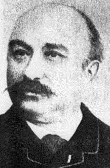

# The FreeCAD Ader Workbench

Cet atelier comprend des outils pour faciliter le dessin d'un avion.
Il s'appuie sur la norme CPACS (https://cpacs.de/) qui décrit un avion (et plus) sous forme d'un fichier xml.
Ader permet de lire et modifier ce fichier par une interface graphique en profitant des outils offerts par FreeCAD.

## Prerequisites
* FreeCAD >= v0.20

## Installation
Copier le dossier dans le dossier des add-ons et relancer FreeCAD.
Nota : sous Windows les addons sont dans C:\Utilisateurs\<Nom utilisateur>\Appdata\Roaming\FreeCAD\Mod

## Quickstart

## Usage

Cet atelier se nomme Ader en hommage à Clément Ader, pionnier de l'aviation. En souhaitant qu'il ait une suite aussi riche que l'aviation depuis M. Ader.

## Feedback

## Roadmap

## Release Notes

## License
MIT
See [LICENSE](LICENSE) file

#Illustrations 
Wikipedia Creative Commons.
